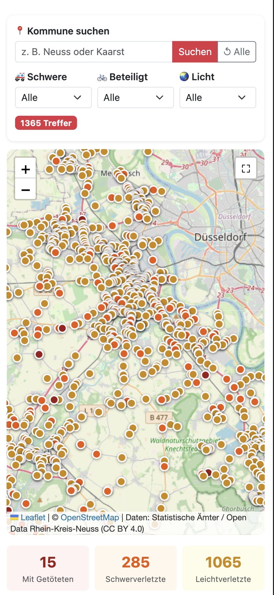

# Unfallatlas - App fuer den Open Data App-Store (ODAS)

Interaktive Unfallatlas-Visualisierung fuer den Open Data App Store.
Die App entspricht der Open Data App-Spezifikation und ist als ODAS App V1 aufgebaut.

---

## Funktionen




Single Page Application mit Karte, Filterleiste, Statistik-Kacheln und Ergebnisliste.
Die Konfiguration wird vom ODAS geladen, in lokaler Entwicklung aus odas-config/config.json.

- Interaktive Karte auf Basis von Leaflet + OpenStreetMap
- Laden der Unfalldaten aus OpenDataSoft API mit Pagination und Ladefortschritt
- Kommune-Suche mit serverseitigem WHERE-Filter
- Schweregrad-Filter (mit Getoeteten, Schwerverletzten, Leichtverletzten)
- Beteiligten-Filter (Fahrrad, Fussgaenger, Motorrad, PKW, LKW)
- Lichtverhaeltnis-Filter (Tageslicht, Daemmerung, Dunkelheit)
- Treffer-Badge mit aktueller Anzahl
- Statistik-Uebersicht: Kategorien, beteiligte Verkehrsmittel, haeufigste Stunde
- Sortierbare Tabelle und Synchronisation mit Karten-Markern
- Vollbildmodus fuer die Karte

---

## Datenquelle

Standardmaessig nutzt die App folgenden Datensatz:

- Open Data Rhein-Kreis Neuss
- Dataset: rhein-kreis-neuss-2022-unfallatlas
- API-Endpunkt: https://opendata.rhein-kreis-neuss.de/api/explore/v2.1/catalog/datasets/rhein-kreis-neuss-2022-unfallatlas/records

Der Endpunkt kann ueber den Konfigurationswert apiurl ueberschrieben werden.

---

## Datenformat

Die App erwartet OpenDataSoft-Records aus API v2.1 (JSON).
Wichtige Felder im Datensatz:

| Feld                                      | Bedeutung                |
| ----------------------------------------- | ------------------------ |
| geo_point_2d.lat/lon                      | Position fuer Marker     |
| kommune                                   | Kommune                  |
| ukategorie                                | Unfallschwere            |
| uart                                      | Unfallart                |
| utyp1                                     | Unfalltyp                |
| ulichtverh                                | Lichtverhaeltnis         |
| uwochentag                                | Wochentag                |
| ustunde                                   | Stunde                   |
| umonat                                    | Monat                    |
| istrad, istfuss, istkrad, istpkw, istgkfz | Beteiligte Verkehrsarten |

---

## Entwicklung

Voraussetzungen:

- Docker / Docker Compose
- Make

Starten:

```bash
make build up
```

Die App ist lokal verfuegbar unter:

http://localhost:8090

Bei localhost-Betrieb wird die lokale Konfiguration aus odas-config/config.json verwendet.

Nuetzliche Befehle:

- make logs
- make restart-web
- make app-info
- make down

---

## Wichtige Dateien

| Datei                   | Beschreibung                                                 |
| ----------------------- | ------------------------------------------------------------ |
| app/app.js              | Hauptlogik: UI, Filter, Datenabruf, Karte, Tabelle, Vollbild |
| odas-config/config.json | Lokale Instanz-Konfiguration (inkl. apiurl)                  |
| app-package.json        | Metadaten und konfigurierbare Instanz-Parameter              |
| docker-compose.yml      | Lokale Ausfuehrung mit Nginx auf Port 8090                   |
| Makefile                | Build/Run-Helfer fuer Entwicklung und Auslieferung           |

---

## Konfiguration (Instanz)

Relevante Parameter fuer diese App:

| Parameter   | Beschreibung                                | Pflicht |
| ----------- | ------------------------------------------- | ------- |
| apiurl      | URL zum OpenDataSoft-Records-Endpunkt       | ja      |
| titel       | Titel der App im Kopfbereich                | ja      |
| seitentitel | Browser-Tab-Titel                           | ja      |
| urlDaten    | Link zur Datensatzseite im Open Data Portal | ja      |
| sprache     | Sprache der App (derzeit de)                | ja      |

---

## Autor

(C) 2026, Ondics GmbH
