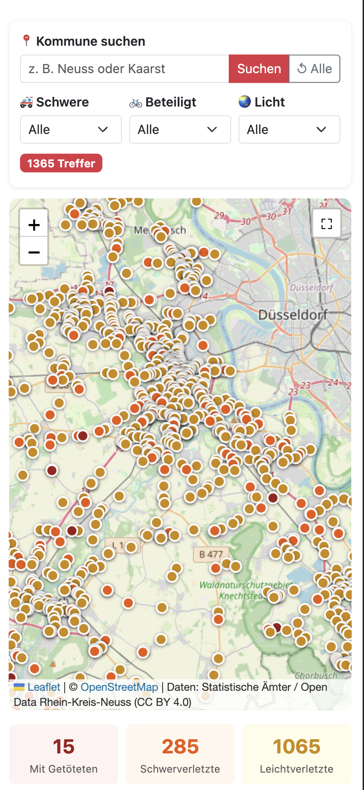

# Unfallatlas - App fuer den Open Data App-Store (ODAS)

Interaktive Unfallatlas-Visualisierung fuer den Open Data App Store.
Die App entspricht der Open Data App-Spezifikation und ist als ODAS App V1 aufgebaut.

---

## Für wen ist diese App?

Diese App richtet sich an Bürger:innen, die sich für Verkehrssicherheit interessieren, sowie an Kommunen und Verkehrsplaner:innen. Sie benötigen keine Datenfachkenntnisse – einfach Kommune eingeben und Unfallschwerpunkte erkunden.

---

## Funktionen




Single Page Application mit Karte, Filterleiste, Statistik-Kacheln und Ergebnisliste.
Die App kann lokal, eigenstaendig hinter einem Traefik-Reverse-Proxy oder ueber den ODAS betrieben werden.

- Interaktive Karte auf Basis von Leaflet + OpenStreetMap
- Laden der Unfalldaten aus OpenDataSoft API mit Pagination und Ladefortschritt
- Kommune-Suche mit serverseitigem WHERE-Filter
- Schweregrad-Filter (mit Getoeteten, Schwerverletzten, Leichtverletzten)
- Beteiligten-Filter (Fahrrad, Fussgaenger, Motorrad, PKW, LKW)
- Lichtverhaeltnis-Filter (Tageslicht, Daemmerung, Dunkelheit)
- Treffer-Badge mit aktueller Anzahl
- Statistik-Uebersicht: Kategorien, beteiligte Verkehrsmittel, haeufigste Stunde
- Sortierbare Tabelle und Synchronisation mit Karten-Markern
- Vollbildmodus fuer die Karte
- Direkter Datenabruf in Entwicklung und Standalone-Betrieb
- Optionaler ODAS-Proxy bei der Auslieferung ueber den ODAS

---

## Datenquelle

Standardmaessig nutzt die App folgenden Datensatz:

- Open Data Rhein-Kreis Neuss
- Dataset: rhein-kreis-neuss-2022-unfallatlas
- API-Endpunkt: https://opendata.rhein-kreis-neuss.de/api/explore/v2.1/catalog/datasets/rhein-kreis-neuss-2022-unfallatlas/records

Der Endpunkt kann ueber den Konfigurationswert apiurl ueberschrieben werden.

---

## Datenformat

Die App erwartet OpenDataSoft-Records aus API v2.1 (JSON).
Wichtige Felder im Datensatz:

| Feld                                      | Bedeutung                |
| ----------------------------------------- | ------------------------ |
| geo_point_2d.lat/lon                      | Position fuer Marker     |
| kommune                                   | Kommune                  |
| ukategorie                                | Unfallschwere            |
| uart                                      | Unfallart                |
| utyp1                                     | Unfalltyp                |
| ulichtverh                                | Lichtverhaeltnis         |
| uwochentag                                | Wochentag                |
| ustunde                                   | Stunde                   |
| umonat                                    | Monat                    |
| istrad, istfuss, istkrad, istpkw, istgkfz | Beteiligte Verkehrsarten |

---

## Einsatzumgebungen

| Umgebung    | Start oder Auslieferung             | Konfiguration                        | Datenabruf                   |
| ----------- | ----------------------------------- | ------------------------------------ | ---------------------------- |
| Entwicklung | `make up` / `http://localhost:8090` | `odas-config/config.json`            | direkt                       |
| Standalone  | `STANDALONE=true make up`           | `odas-config/config.json`            | direkt                       |
| ODAS        | `make zip` / Veroeffentlichung      | vom ODAS erzeugter Endpunkt `config` | direkt oder mit `proxyAktiv` |

Entwicklung und Standalone verwenden dieselbe lokale Datei `odas-config/config.json`. Der Config-Loader in `app/app-base.js` laedt sie auf `localhost` unter `/odas-config/config.json`. Bei einem Standalone-FQDN fragt er `/config` ab; Nginx liefert dort dieselbe gemountete Datei aus.

## Lokale Entwicklung

Voraussetzungen:

- Docker / Docker Compose
- Make

Starten:

```bash
make up
```

Die App ist lokal verfuegbar unter:

http://localhost:8090

Bei localhost-Betrieb wird die lokale Konfiguration aus odas-config/config.json verwendet.
Sie enthaelt `proxyAktiv: "nein"`, damit der Browser die Datenquelle direkt abruft.

Nuetzliche Befehle:

- make logs
- make config
- make ps
- make down

---

## Standalone-Betrieb hinter Traefik

Fuer den Standalone-Betrieb wird ein bereits vorhandener Traefik-Reverse-Proxy vorausgesetzt. Die App selbst liefert HTTP intern auf Port `80`; Traefik uebernimmt FQDN, HTTPS-Zertifikat und Weiterleitung. Der App-Container veroeffentlicht dabei keinen Host-Port.

Vor dem Start:

1. In `docker-compose.standalone.yml` den FQDN `appname.example.com` durch den echten Hostnamen ohne Protokoll oder Pfad ersetzen.
2. `odas-config/config.json` an Betreiber, Datenquelle und rechtliche Texte anpassen.
3. Sicherstellen, dass `proxyAktiv` auf `nein` steht.
4. Pruefen, dass Traefik das externe Docker-Netzwerk `proxynet`, den EntryPoint `websecure` und den Zertifikatsresolver `letsencrypt` verwendet.

Starten:

```bash
STANDALONE=true make up
```

Weitere Befehle:

```bash
STANDALONE=true make logs
STANDALONE=true make config
STANDALONE=true make ps
STANDALONE=true make down
```

Ohne `STANDALONE=true` verwenden dieselben Make-Ziele ausschliesslich `docker-compose.yml` fuer die Entwicklung.

### Standalone-Konfiguration und Shortcodes

ODAS-Shortcodes wie `{{odp.anbieter.name}}`, `{{odp.logo}}` oder `{{jahr}}` werden nur vom ODAS aufgeloest. In `odas-config/config.json` muessen deshalb fertige Werte stehen. Rich-Text-Felder wie `beschreibung`, `kontakt`, `impressum` und `datenschutz` koennen direktes HTML enthalten.

### CORS und ODAS-Proxy

Die Entwicklungs- und Standalone-Konfiguration setzen `proxyAktiv: "nein"`. Der Browser ruft die konfigurierte `apiurl` deshalb direkt auf. Bei fehlenden CORS-Headern zeigt die App einen Hinweis auf Daten-URL und CORS-Freigabe; ein automatischer Proxy-Fallback ist nicht vorhanden.

Bei der Auslieferung ueber den ODAS kann `proxyAktiv: "ja"` den ODAS-Proxy einschalten. Dabei sendet die App einen `POST` an `<App-Basispfad>/odp-data` und uebergibt nur Pfad und Query der Ziel-URL als URL-kodierten `path`-Parameter. Echte Proxy-Aufrufe koennen nur im ODAS-Live-System vollstaendig getestet werden.

---

## Betrieb ueber den ODAS

Die ODAS-Auslieferung bleibt unveraendert: `make zip` packt `app/`, `assets/`, `app-package.json` und `CHANGELOG.md`. Docker-, Standalone- und lokale Config-Dateien sind nicht Bestandteil dieses ZIP-Pakets.

Der ODAS erzeugt die Instanz-Konfiguration wie bisher aus `app-package.json`. `proxyAktiv` bleibt standardmaessig `nein` und kann bei CORS-sensitiven Portalquellen auf `ja` gesetzt werden. Zusaetzliche alte Config-Schluessel werden von der App ignoriert. An der ODAS-Plattform selbst ist keine Aenderung erforderlich.

---

## Wichtige Dateien

| Datei                           | Beschreibung                                               |
| ------------------------------- | ---------------------------------------------------------- |
| `app/app.js`                    | UI, Filter, Datenabruf, Karte und Tabelle                  |
| `odas-config/config.json`       | Gemeinsame Konfiguration fuer Entwicklung und Standalone   |
| `app-package.json`              | Metadaten und konfigurierbare ODAS-Instanz-Parameter       |
| `docker-compose.yml`            | Lokale Ausfuehrung mit Nginx auf Port 8090                 |
| `docker-compose.standalone.yml` | Traefik-Ergaenzung ohne veroeffentlichten Host-Port        |
| `Makefile`                      | Befehle fuer Entwicklung, Standalone und ODAS-Auslieferung |

---

## Konfiguration

Wichtige Werte in `odas-config/config.json`:

| Parameter | Bedeutung |
| --------- | --------- |
| `apiurl` | OpenDataSoft-Endpunkt, aus dem die Unfalldaten geladen werden |
| `urlDaten` | Datensatzseite im Open Data Portal |
| `proxyAktiv` | Muss fuer Entwicklung und Standalone `nein` sein |
| `titel`, `seitentitel`, `icon` | Darstellung der App |
| `kontakt`, `impressum`, `datenschutz`, `fusszeile` | Betreiber- und Rechtstexte |

Im ODAS werden dieselben Felder aus `app-package.json` zur Instanz-Konfiguration erzeugt. Dort kann `proxyAktiv: "ja"` den vorhandenen ODAS-Proxy verwenden.

---

## Technische Pruefung

```bash
node --check app/app.js
node --check app/app-base.js
python3 -m json.tool app-package.json >/dev/null
python3 -m json.tool odas-config/config.json >/dev/null
python3 -m json.tool assets/schema.json >/dev/null
docker compose -f docker-compose.yml config
docker compose -f docker-compose.yml -f docker-compose.standalone.yml config
make help
```

---

## Beim Aufruf kontaktierte Drittanbieter

Beim Aufruf dieser App werden folgende externe Server kontaktiert:

- `cdn.jsdelivr.net` — Bootstrap (Layout- und UI-Framework)
- `unpkg.com` — Leaflet (Kartendarstellung)
- `tile.openstreetmap.org` — Kartenkacheln (OpenStreetMap)

Diese Anbieter bleiben auch im Standalone-Betrieb extern; ein vollständig autarker Betrieb ohne Internetzugang ist derzeit nicht möglich (siehe F-07 in `Review.md`).

## Autor

(C) 2026, Ondics GmbH
